# LucentCV — Çok Adımlı AI Agent ile CV-İlan Uyum Analizi

## Takım İsmi
Takım 126

## Takım Elemanları

- **Burak Baygün** – Developer
- **Büşra Demir** – Scrum Master & Developer
- **Asil Doğukan Samay** –  Product Owner & Developer
- **Ece Toygun** – Developer
- **Nuri Duldar** – Developer

## Ürün İsmi
LucentCV

## Ürün Açıklaması
LucentCV, bir kullanıcının CV metnini ve başvurmak istediği iş ilanının metnini analiz ederek,
ikisi arasındaki uyumu değerlendiren bir yapay zeka uygulamasıdır. Tek bir prompt'a değil,
**birbirini besleyen 7 ayrı AI agent'ına** dayanır:

1. **CV Analyzer Agent** — CV'deki beceri, deneyim ve eğitim bilgilerini yapılandırılmış
   şekilde çıkarır.
2. **Job Analyzer Agent** — İlan metnindeki gereksinimleri, aranan anahtar kelimeleri ve
   sorumlulukları çıkarır.
3. **Matcher Agent** — İlk iki agent'ın çıktısını karşılaştırarak bir uyum skoru, eksik
   kalan noktaları ve CV'yi güçlendirmek için somut öneriler üretir.
4. **Interview Generator Agent** — CV analizi, ilan analizi ve uyum değerlendirmesine göre
   adaya özel 5 mülakat sorusu üretir (güçlü noktalar, eksik beceriler, senaryo ve
   deneyim soruları karışık şekilde).
5. **Interview Evaluator Agent** — Kullanıcının mülakat sorularına verdiği cevapları
   değerlendirir; soru bazlı puan, genel skor, güçlü yönler ve geliştirilmesi gereken
   alanlar üretir.

Uygulama ayrıca basit bir **hafıza (memory) katmanı** içerir: kullanıcının geçmişte yaptığı
analizler yerel bir JSON dosyasında saklanır ve tekrar görüntülenebilir, böylece zaman
içindeki gelişim takip edilebilir.

## Ürün Özellikleri
- CV ve ilan metni girişi
- 5 agent'lı orkestrasyon (CV Analyzer → Job Analyzer → Matcher → Interview Generator → Interview Evaluator)
- Uyum skoru (0-100), eksik beceri/anahtar kelime listesi, somut iyileştirme önerileri
- **Akıllı Mülakat Simülasyonu**: CV ve ilana özel üretilen 5 mülakat sorusu, kullanıcının cevaplarının AI tarafından değerlendirilmesi (soru bazlı puan + genel geri bildirim)
- Geçmiş analizleri saklayan Supabase tabanlı bulut veritabanı
- Premium SaaS standartlarında, modern arayüz ve kullanıcı deneyimi

## Hedef Kitle
- Aktif iş başvurusu yapan üniversite mezunları ve yeni başlayanlar
- ATS (Applicant Tracking System) uyumlu CV hazırlamak isteyen adaylar
- Kariyer değişikliği yapan, CV'sini farklı sektörlere uyarlaması gereken kişiler

## Product Backlog
Sprint bazlı backlog için `sprints/` klasörüne bakınız.


# Sprint 1

## Sprint 1 Product Backlog

| # | User Story | Öncelik | Durum |
|---|---|:---:|:---:|
| 1 | Kullanıcı olarak CV metnimi ve iş ilanını sisteme girebilmeliyim. | Yüksek | ✅ Tamamlandı |
| 2 | Kullanıcı olarak CV analiz sonuçlarını görüntüleyebilmeliyim. | Yüksek | ✅ Tamamlandı |
| 3 | Kullanıcı olarak iş ilanı analizini görüntüleyebilmeliyim. | Yüksek | ✅ Tamamlandı |
| 4 | Kullanıcı olarak CV ve ilan arasındaki uyum skorunu ve önerileri görebilmeliyim. | Yüksek | ✅ Tamamlandı |
| 5 | Kullanıcı olarak CV ve ilana özel AI mülakat soruları oluşturabilmeliyim. | Yüksek | ✅ Tamamlandı |
| 6 | Kullanıcı olarak mülakat cevaplarımın AI tarafından değerlendirilmesini alabilmeliyim. | Yüksek | ✅ Tamamlandı |
| 7 | Kullanıcı olarak analiz geçmişimi görüntüleyebilmeliyim. | Orta | ✅ Tamamlandı |
| 8 | Kullanıcı olarak CV dosyamı PDF/DOCX formatında yükleyebilmeliyim. | Orta | ✅ Tamamlandı |
| 9 | Kullanıcı olarak analiz geçmişimin Supabase üzerinde saklanmasını istiyorum. | Orta | ✅ Tamamlandı |
| 10 | Kullanıcı olarak analiz sonuçlarını PDF veya Markdown olarak dışa aktarabilmeliyim. | Düşük | ⏳ Sprint 2 |
| 11 | Kullanıcı olarak Google hesabımla giriş yapabilmeliyim. | Orta | ⏳ Sprint 2 |
| 12 | Modern React tabanlı kullanıcı arayüzüne geçilmelidir. | Yüksek | ⏳ Sprint 2 |
| 13 | Uygulamanın production ortamına deploy edilmesi. | Orta | ⏳ Sprint 3 |

---

## Backlog Düzeni ve Story Seçimleri

Sprint 1 backlog'u hazırlanırken öncelik, kullanıcıya çalışabilir bir Minimum Viable Product (MVP) sunacak temel fonksiyonlara verilmiştir. Kullanıcı hikâyeleri öncelik seviyelerine göre sıralanmış, geliştirilebilir alt görevlere (task) ayrılmış ve ekip üyeleri arasında paylaştırılmıştır.

Sprint boyunca çoklu AI Agent mimarisi, Google Gemini entegrasyonu, Supabase veri yönetimi, CV analiz sistemi ve Akıllı Mülakat modülü başarıyla tamamlanmıştır.

Dışa aktarma (Export), Google Authentication ve modern React tabanlı frontend mimarisine geçiş gibi geliştirmeler ise Sprint 2 kapsamına aktarılmıştır.

---

## Daily Scrum
 
Ekip üyelerimizin profesyonel çalışma takvimlerinin yoğunluğu ve son dönemde özel
hayatlarında gelişen durumların sebebiyet verdiği meşguliyetler nedeniyle, gün
içerisinde herkesin katılabileceği ortak bir zaman dilimi oluşturmak mümkün
olmamıştır. Süreci aksatmamak, birbirimize destek olmak ve ilerlememizi
şeffaf bir şekilde sürdürebilmek adına iletişimin Slack üzerinden asenkron
olarak yürütülmesine karar verilmiştir.
 
Projenin genel gidişatı, görev dağılımı ve anlık ilerleme durumu Slack grup
sohbetimizde paylaşılan mesajlar üzerinden yürütülmüştür. İlgili iletişim süreci
ekteki bağlantıda sunulmuştur: [iletişim sürecinden kesitler](https://imgur.com/a/R4R2gFU)
 
### Toplantı Özeti
 
#### Genel Durum ve Proje Birleştirme

- Sprint başlangıcında proje kapsamı ve teknik gereksinimler değerlendirilerek ortak geliştirme planı oluşturuldu.
- Geliştirme süreci boyunca ekip içi koordinasyon sağlanarak tüm üyeler aktif şekilde projeye katkı sundu.
  
#### Görev Dağılımı (Sprint 1)
- **Asil Doğukan Samay:** Backlog Dağıtma Mantığı (Sprint Planning, User
  Story'ler, Story Point'ler, Backlog açıklaması ve GitHub Project linki)
- **Burak Baygün:** Daily Scrum sürecinin belgelenmesi
- **Büşra Demir:** Sprint Retrospective, Ürün Durumu ve Sprint Review
  aşamalarının hazırlanması
- **Nuri Duldar:** Sprint Board'un Miro kullanılarak hazırlanması

### Sprint 2 Vizyonu
 
- **Veritabanı:** Veriler yerel JSON yerine Supabase'e taşınacak. Ortam
  değişkeni tanımlı değilse sistem otomatik olarak `local_db.json` ile
  çalışmaya devam edecek (local fallback).
- **Model Çıktı Kararlılığı:** Gemini'nin geçersiz JSON döndürme sorununu
  çözmek için `google-genai` SDK'sının Pydantic şema desteği entegre edilecek.
- **Frontend:** Next.js, React, Tailwind ve TypeScript ile modern mimariye
  geçilecek.
- **Kullanıcı Deneyimi:**
  - Sürükle-bırak dosya yükleme + PDF/DOCX'ten otomatik metin çıkarma (parser)
  - Analiz sonuçlarını PDF/Markdown olarak dışa aktarma
  - Uyum skorunu dairesel grafik ve ilerleme barlarıyla gösteren dashboard
  - Google hesabıyla giriş (kimlik doğrulama)
---

## Sprint Board Update

.png)

## Ürün Durumu

### Ana Sayfa

<p align="center">
  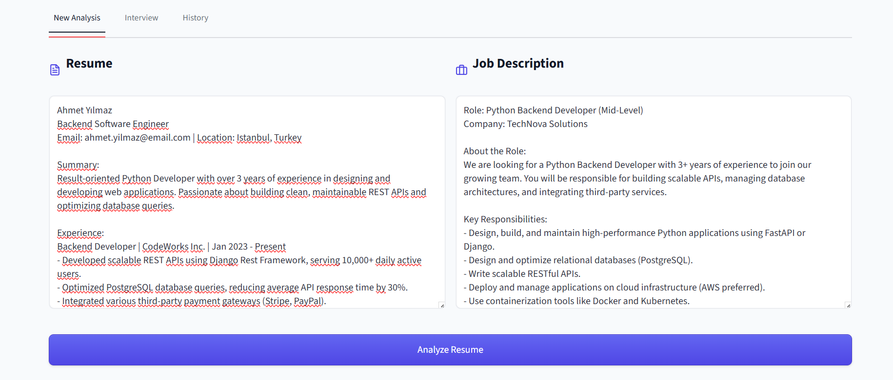
</p>

### CV - İş İlanı Analizi

<p align="center">
  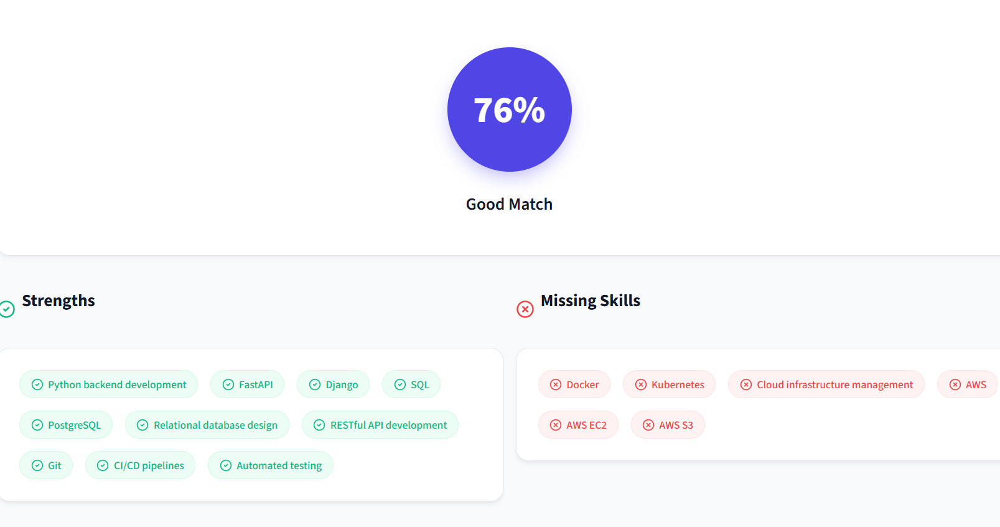
</p>

### Akıllı Mülakat Simülasyonu

<p align="center">
  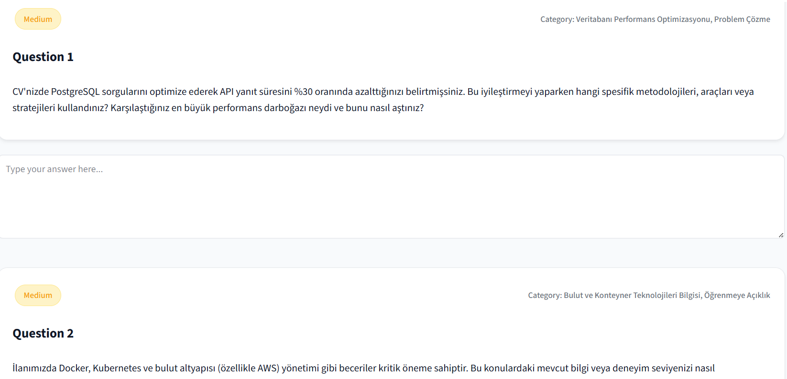
</p>

### Geçmiş Analizler

<p align="center">
  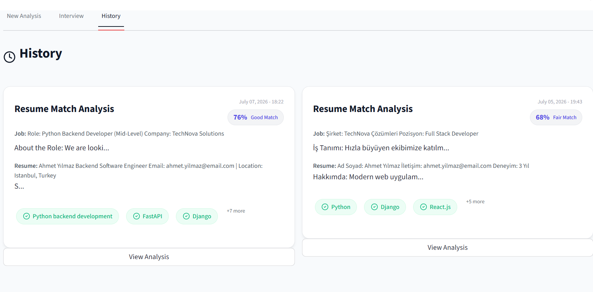
</p>

---

## Sprint Review

Sprint 1 sonunda LucentCV'nin çalışabilir **Minimum Viable Product (MVP)** sürümü başarıyla tamamlanmıştır.

Bu sprint kapsamında kullanıcıların CV ve iş ilanı metinlerini analiz edebildiği, çoklu AI Agent mimarisi ile uyum skorunu görüntüleyebildiği, kişiselleştirilmiş mülakat soruları oluşturabildiği ve cevaplarını yapay zekâ tarafından değerlendirebildiği çalışan bir sistem ortaya çıkarılmıştır.

### Sprint Boyunca Tamamlanan Geliştirmeler

- Çoklu AI Agent mimarisi (CV Analyzer, Job Analyzer, Matcher, Interview Generator ve Interview Evaluator) geliştirildi.
- Google Gemini API entegrasyonu tamamlandı.
- Supabase entegrasyonu gerçekleştirilerek analiz geçmişi PostgreSQL veritabanında saklanmaya başlandı.
- PDF ve DOCX dosya yükleme desteği eklendi.
- Streamlit tabanlı arayüz yeniden düzenlenerek component tabanlı daha modüler bir yapı oluşturuldu.
- Services ve Database katmanları oluşturularak kod yapısı sadeleştirildi.
- AI destekli mülakat oluşturma ve değerlendirme sistemi geliştirildi.
- Uygulamanın temel kullanıcı akışı uçtan uca çalışır hale getirildi.

Sprint sonunda yapılan değerlendirmelerde mevcut MVP'nin proje hedeflerini karşıladığı görülmüş, ancak kullanıcı deneyimi, sürdürülebilirlik ve ölçeklenebilirlik açısından yeni bir mimariye geçilmesinin gerekli olduğuna karar verilmiştir.

### Sprint Review Katılımcıları

- Burak Baygün — Developer
- Büşra Demir — Scrum Master
- Asil Doğukan Samay — Product Owner
- Ece Toygun — Developer
- Nuri Duldar — Developer

---

## Sprint Retrospective

Sprint sonunda geliştirilen ürün ve teknik süreç ekip tarafından değerlendirilmiştir. Sprint 1 hedeflerinin büyük bölümü başarıyla tamamlanmış ve çalışan bir MVP ortaya çıkarılmıştır.

### Güçlü Yönler

- Çoklu AI Agent mimarisi başarıyla geliştirildi.
- Google Gemini API entegrasyonu tamamlandı.
- Supabase ile kalıcı veri yönetimine geçildi.
- PDF/DOCX yükleme desteği eklendi.
- AI destekli mülakat oluşturma ve değerlendirme sistemi geliştirildi.
- Services, Components ve Database katmanları oluşturularak proje daha modüler hale getirildi.
- MVP sürümü başarıyla tamamlandı.

### İyileştirilmesi Gereken Noktalar

- Streamlit mimarisinin uzun vadede kullanıcı deneyimi açısından sınırlı olduğu görüldü.
- Frontend ve backend'in aynı yapı içerisinde bulunması geliştirme süreçlerini zorlaştırmaktadır.
- Kod tabanının API tabanlı ve bağımsız servislerden oluşan modern bir mimariye dönüştürülmesi gerektiği değerlendirildi.
- Responsive tasarım ve modern UI/UX standartlarının uygulanmasına ihtiyaç olduğu belirlendi.
- Code Review, Pull Request ve test süreçlerinin daha sistematik yürütülmesine karar verildi.


# Sprint 2

## Daily Scrum

Sprint 2 süresince ekip üyelerinin farklı çalışma saatlerine sahip olması nedeniyle Daily Scrum toplantıları senkron olarak gerçekleştirilememiştir. Bunun yerine proje yönetimi, görev takibi ve teknik iletişim Slack üzerinden asenkron olarak yürütülmüştür.

Sprint boyunca mimari dönüşüm, görev dağılımları, teknik problemler, kod incelemeleri, test süreçleri ve ilerleme durumları Slack üzerinden düzenli olarak paylaşılmıştır. GitHub üzerinde branch tabanlı geliştirme modeli benimsenmiş; her ekip üyesi geliştirmelerini kendi branch'i üzerinde tamamlayarak Pull Request (PR) oluşturmuş ve kodlar ekip tarafından incelendikten sonra ana dala birleştirilmiştir.

İlgili iletişim süreci ve Daily Scrum paylaşımlarına aşağıdaki bağlantı üzerinden ulaşılabilir:

**İletişim Sürecinden Kesitler:**  
https://imgur.com/a/LcQ2C2o

### Toplantı Özeti

#### Genel Durum

- Sprint 1 sonunda alınan mimari dönüşüm kararı doğrultusunda proje tamamen yeniden yapılandırıldı.
- Streamlit tabanlı yapı kaldırılarak **Next.js + FastAPI** tabanlı modern mimariye geçildi.
- Supabase altyapısı yeniden oluşturuldu ve ekip üyeleri projeye davet edilerek ortak veritabanı kullanılmaya başlandı.
- Görev dağılımları Slack üzerinden planlandı ve geliştirme süreci GitHub üzerinde branch, Pull Request ve Merge süreçleri ile yönetildi.
- Ekip üyeleri geliştirdikleri modülleri birbirlerinin geri bildirimleri doğrultusunda test ederek eksik görülen noktaları birlikte tamamladı.
- Sprint sonunda README, Sprint dokümantasyonu ve son düzenlemelerin birlikte tamamlanmasına karar verildi.

#### Görev Dağılımı (Sprint 2)

- **Büşra Demir:** Mimari dönüşümün gerçekleştirilmesi, Streamlit'ten Next.js + FastAPI mimarisine geçiş, Supabase entegrasyonu, temel UI altyapısının hazırlanması, ekip koordinasyonu ve kod birleştirme süreçlerinin yönetilmesi.
- **Asil Doğukan Samay:** Authentication sistemi (Login, Register, Session Management, Protected Routes, Logout ve Google Authentication).
- **Burak Baygün:** AI destekli Mülakat Simülasyonu modülünün geliştirilmesi ve çalışır hale getirilmesi.
- **Nuri Duldar:** PDF Export özelliğinin tamamlanması, modern popup ve bildirim sistemlerinin (AlertDialog & Sonner Toast) uygulanması ve kullanıcı deneyiminin iyileştirilmesi.
- **Ece Toygun:** Sprint 3 kapsamında uygulamanın **Vercel** üzerinde canlı ortama alınması (deployment) ve yayınlama sürecinin planlanması.

### Sprint 3 Vizyonu

- Uygulamanın Vercel (Frontend) ve Render/Railway (Backend) üzerinde production ortamına alınması.
- Performans ve güvenlik optimizasyonlarının tamamlanması.
- AI analizlerinin doğruluğunu artıracak iyileştirmelerin yapılması.
- Son UI/UX düzenlemeleri ve kullanıcı deneyimi geliştirmelerinin tamamlanması.
- Test kapsamının genişletilmesi ve son hata düzeltmelerinin yapılması.
- README, proje dokümantasyonu ve kurulum rehberinin güncellenmesi.
- Bootcamp final sunumu ve demo senaryosunun hazırlanması.

## Ürün Durumu (Sprint 2)

### 1. Giriş ve Kayıt Ekranı
<p align="center">
  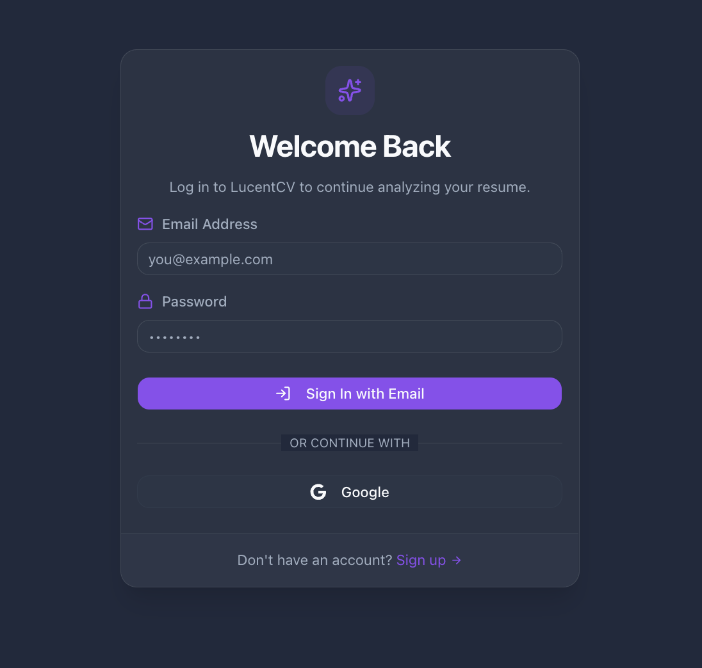
</p>

<p align="center">
  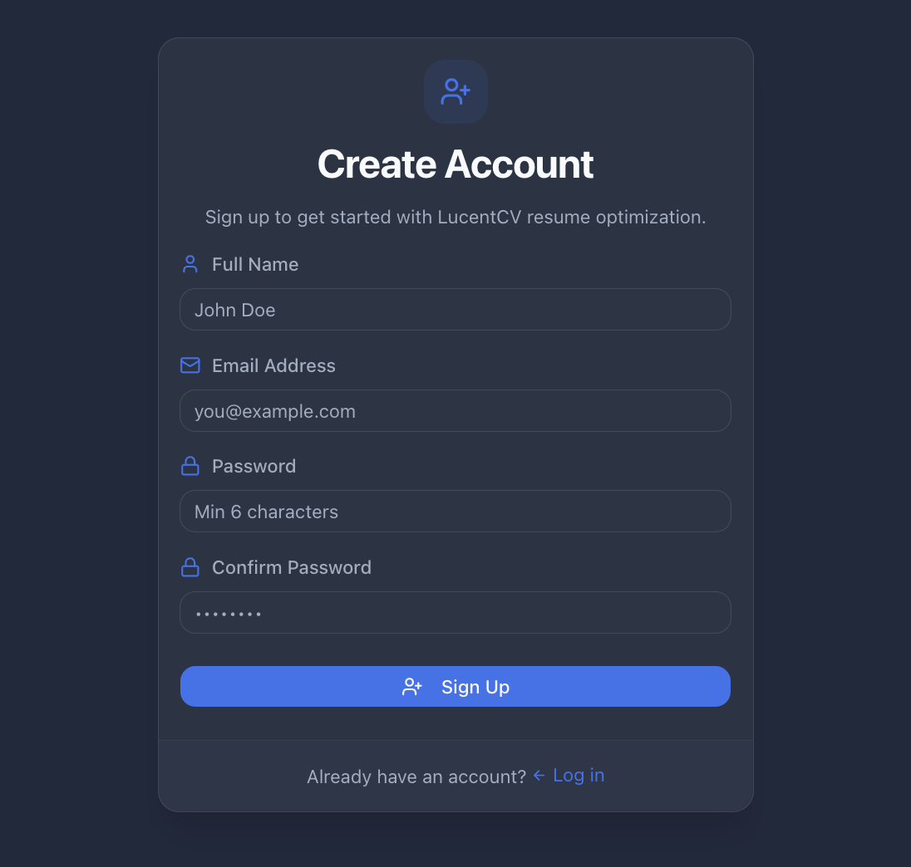
</p>

### 2. Ana Sayfa (Dashboard)
<p align="center">
  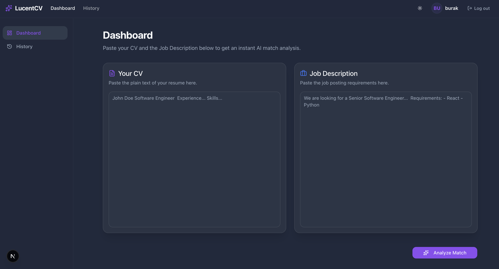
</p>

<p align="center">
  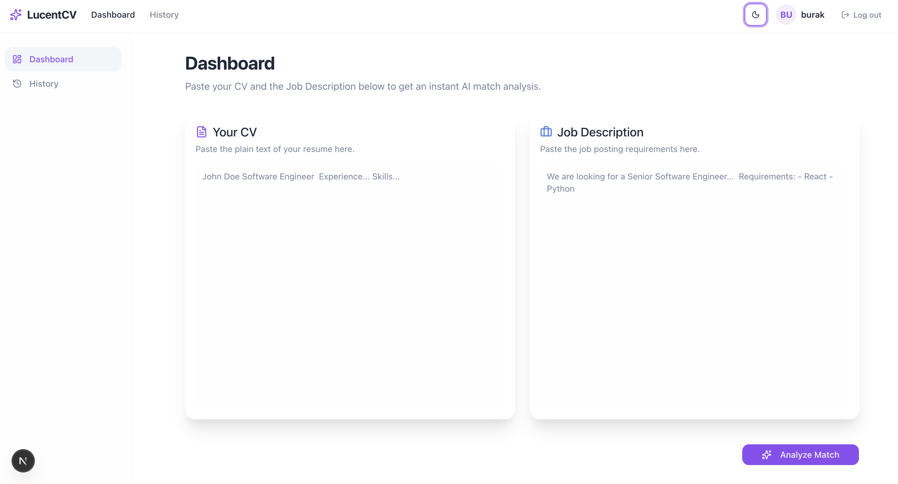
</p>


### 3. CV - İş İlanı Analizi 
<p align="center">
  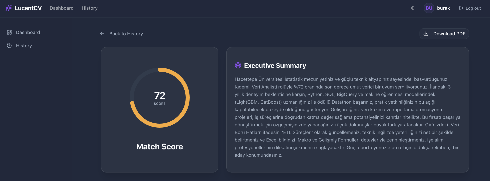
</p>

### 3. Akıllı Mülakat Simülasyonu
<p align="center">
  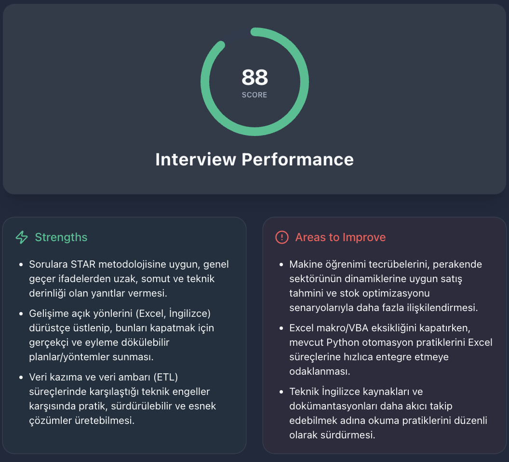
</p>
<p align="center">
  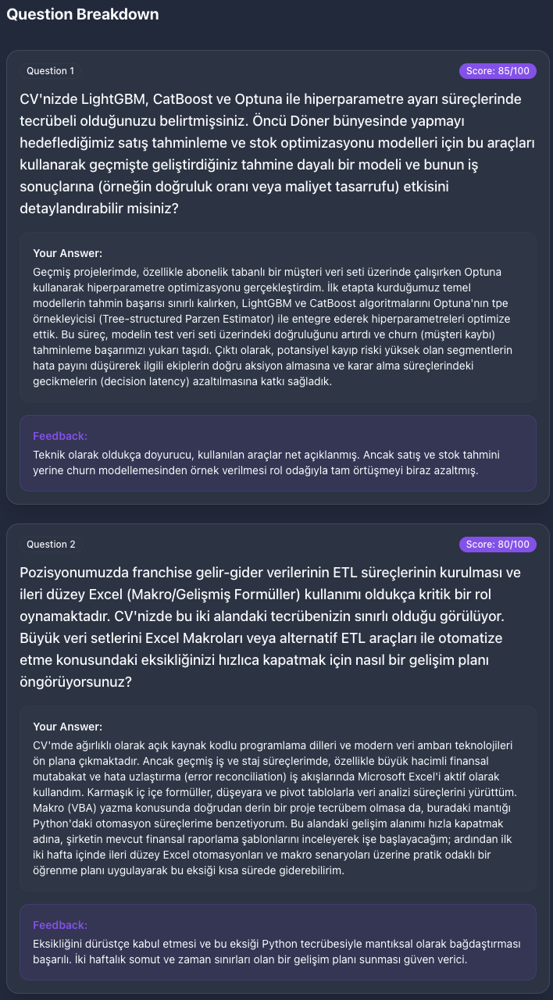
</p>

## Sprint Review

Sprint 2 boyunca **LucentCV**, MVP seviyesinden modern ve ölçeklenebilir bir **SaaS** mimarisine dönüştürülmüştür. Sprint 1'de geliştirilen temel AI iş mantığı korunurken, uygulamanın teknik altyapısı tamamen yeniden yapılandırılmış ve profesyonel web geliştirme standartlarına uygun hale getirilmiştir.

### Sprint Boyunca Tamamlanan Geliştirmeler

- Streamlit tabanlı monolitik yapı kaldırılarak **Next.js + FastAPI** tabanlı ayrık (Frontend/Backend) mimariye geçildi.
- Backend tarafında **Clean Architecture** uygulanarak API, Services, Controllers, Repositories, Schemas ve AI Agent katmanları oluşturuldu.
- Mevcut AI iş akışı korunarak **Controller Agent** yapısıyla modüler çoklu AI Agent mimarisi geliştirildi.
- **Supabase PostgreSQL** entegrasyonu tamamlandı ve analiz geçmişinin kalıcı olarak saklanması sağlandı.
- Yeni **Dashboard** ve **History** sayfaları geliştirildi.
- Geçmiş analizlerini görüntüleme ve silme işlemleri sisteme eklendi.
- **Authentication** sistemi geliştirilerek Email/Password, Google Authentication, Session Management, Protected Routes ve Logout işlemleri uygulamaya entegre edildi.
- Guest Mode kaldırılarak kullanıcı bazlı analiz yönetimine geçildi.
- **PDF Export** özelliği çalışır hale getirildi.
- Eski `window.alert()` ve `window.confirm()` yapıları yerine **shadcn/ui AlertDialog** ve **Sonner Toast** kullanılarak modern bildirim sistemi oluşturuldu.
- **Dark / Light Mode** desteği uygulamaya eklendi.
- AI destekli **Mülakat Simülasyonu** modülü çalışır hale getirildi.
- Kod yapısı yeniden düzenlenerek modülerlik, okunabilirlik ve sürdürülebilirlik artırıldı.
- GitHub üzerinde **branch**, **Pull Request** ve **Merge** süreçleri kullanılarak ekip çalışması yürütüldü.

Sprint sonunda LucentCV; modern kullanıcı arayüzüne sahip, kullanıcı kimlik doğrulaması bulunan, analiz geçmişini saklayabilen, PDF rapor oluşturabilen ve AI destekli analiz ile mülakat süreçlerini yöneten çalışır durumda bir SaaS platformuna dönüştürülmüştür.

### Sprint Review Katılımcıları

- Burak Baygün — Developer
- Büşra Demir — Scrum Master
- Asil Doğukan Samay — Product Owner
- Ece Toygun — Developer
- Nuri Duldar — Developer

---

## Sprint Retrospective

Sprint 2 sonunda ekip olarak uygulamanın teknik altyapısını tamamen yenileyerek LucentCV'yi modern web teknolojilerine uygun hale getirdik. Sprint hedeflerinin büyük bölümü başarıyla tamamlandı ve uygulama, yalnızca çalışan bir MVP olmaktan çıkarılarak daha profesyonel, sürdürülebilir ve ölçeklenebilir bir yapıya dönüştürüldü.

### Güçlü Yönler

- Streamlit mimarisi tamamen kaldırılarak modern **Next.js + FastAPI** mimarisine geçildi.
- Clean Architecture prensipleri uygulanarak backend katmanları yeniden tasarlandı.
- AI Agent yapısı modüler hale getirildi ve mevcut analiz akışı korundu.
- Supabase PostgreSQL entegrasyonu başarıyla tamamlandı.
- Authentication sistemi (Email/Password, Google Login, Session Management ve Protected Routes) uygulamaya eklendi.
- Dashboard ve History ekranları geliştirildi.
- PDF Export özelliği aktif hale getirildi.
- Dark / Light Mode desteği eklendi.
- Modern popup ve bildirim sistemi (AlertDialog ve Sonner Toast) ile kullanıcı deneyimi iyileştirildi.
- GitHub üzerinde Branch, Pull Request ve Merge süreçleri kullanılarak ekip çalışması düzenli şekilde yürütüldü.

### İyileştirilmesi Gereken Noktalar

- AI analiz sonuçlarının doğruluğu ve öneri kalitesi geliştirilebilir.
- Kullanıcı deneyimini artıracak ek animasyonlar ve mikro etkileşimler eklenebilir.
- Unit test ve entegrasyon testlerinin kapsamı genişletilebilir.
- API performansı ve hata yönetimi optimize edilebilir.
- Responsive tasarım farklı cihazlarda daha kapsamlı test edilmelidir.
- Code Review süreçleri daha sistematik hale getirilebilir.

### Sprint 3 Kararları

Sprint 3'te uygulamanın production seviyesine taşınması ve son kullanıcı deneyiminin iyileştirilmesi hedeflenmektedir.

Bu kapsamda alınan kararlar:

- Kullanıcı arayüzünde son tasarım iyileştirmelerinin yapılması.
- AI analizlerinin doğruluğunu artıracak prompt ve model optimizasyonlarının gerçekleştirilmesi.
- Performans ve güvenlik optimizasyonlarının tamamlanması.
- Test kapsamının genişletilmesi ve eksik senaryoların tamamlanması.
- Uygulamanın **Vercel (Frontend)** ve **Render/Railway (Backend)** ortamlarında canlıya alınması.
- README ve proje dokümantasyonunun güncellenmesi.
- Bootcamp final sunumu için demo senaryosu ve proje çıktılarının hazırlanması.

Sprint 3 sonunda LucentCV'nin production-ready, sürdürülebilir ve sunuma hazır bir AI kariyer platformu haline getirilmesi hedeflenmektedir.

---

# Sprint 3

> Sprint 3 dokümantasyonu sprint sonunda eklenecektir.


## Kurulum
```bash
# Backend
cd backend
pip install -r requirements.txt
uvicorn main:app --reload

# Frontend
cd frontend
npm install
npm run dev
